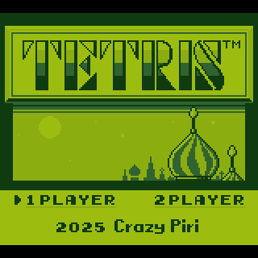

# Tetris GB Clone for PicoCalc



This project is a **clone of the original Game Boy Tetris**, built specifically for the **PicoCalc**, a DIY calculator based on the Raspberry Pi Pico and using the **pkklib** library (used for rendering, input, and sound) available at [https://github.com/redbug26/pkklib](https://github.com/redbug26/pkklib)

---

## 🎮 Features

- Faithful reproduction of the original Game Boy gameplay
- Responsive controls adapted to PicoCalc
- Progressive difficulty system
- Compact and optimized C code for embedded hardware

---

## 🔧 Requirements

- A functional **PicoCalc**
- The **SD Boot firmware** installed on your PicoCalc  
  👉 [https://github.com/adwuard/Picocalc_SD_Boot](https://github.com/adwuard/Picocalc_SD_Boot)

---

## 🚀 Installation

### Option 1 — Build from source

1. Clone the repositories:
```bash
git clone https://github.com/redbug26/pkklib
git clone https://github.com/redbug26/picocalc-tetris
```

2.	Build the project:

```bash
cd tetris-picocalc
./toolchain.sh
cmake . & make
cd out
```

3.	You will get a tetris.bin file in the **out** directory.

4.	Copy tetris.bin to the SD card of your PicoCalc.

⸻

### Option 2 — Install from release

1.	Download the latest tetris.bin from the Releases section.
2.	Copy it to the SD card of your PicoCalc.
3.	Boot the PicoCalc — the game will appear in the launcher menu.

⸻

## 📁 Project structure

- src/ — C source code of the game
- res/ — Game resources (music, graphics)
- CMakeLists.txt — CMake build configuration

⸻

## 💡 About

- This game was built using [pkklib](https://github.com/redbug26/pkklib), a lightweight C library for embedded Pico projects.
- Tetris is a registered trademark of The Tetris Company. 
- This clone is a non-commercial, fan-made project for educational and nostalgic purposes.

⸻

## ✅ License

This project is released under the MIT license.
